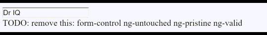
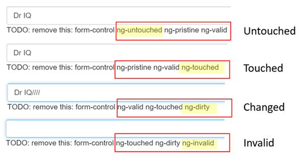

# [Template-driven Forms - 模板驱动表单](https://angular.io/guide/user-input)  

> 主要介绍使用Angular表单一些内置的 css `class` 以及内置的控制器,使表单控制更加方便.   


**`Angular`表单分为两部分**: 基于`HTML的模板`和`组件类`，用来程序处理数据和交互。

## 组件类

```html
<form #heroForm="ngForm">
    ...
</form>
```

把整个表单指令的引用赋值给 `heroForm` 变量.  

> NgForm 指令   
> 什么是`NgForm`指令？但你明明没有添加过[NgFrom](https://angular.io/api/forms/NgForm)指令！   
> `Angular`替你做了。`Angular`会在`<form>`标签上自动创建并附加一个`NgForm`指令。  
> `NgForm`指令为`form`增补了一些额外特性。他会控制那些带有`NgModel`指令和`name`属性的元素,监听他们的属性(包括其有效性).它还有自己的`valid`属性,这个属性只有在`它包含的每个控件都有效`时才是真的.   


```html
<input type="text" class="form-control" id="name"
       required
       [(ngModel)]="model.name" name="name">
TODO: remove this: {{model.name}}
```

**注意**: `<input>`标签还添加了`name`属性(attribute),并设置为“name”，表示英雄的名字。使用任何唯一的值都可以，但是用具有描述性的名字会更有帮助。***当在表单中使用`[(ngModel)]`时,必须要定义`name`属性。***   

> 在`Angular`内部,`Angular`创建了一些`FormControl`，并把它们注册到`NgFrom`指令，再将该指令附加到`<form>`标签。注册每个`FormControl`时，使用`name`属性作为键值。   


​    
​      


```html
{{diagnostic}}
<div class="form-group">
  <label for="name">Name</label>
  <input type="text" class="form-control" id="name"
         required
         [(ngModel)]="model.name" name="name">
</div>

<div class="form-group">
  <label for="alterEgo">Alter Ego</label>
  <input type="text"  class="form-control" id="alterEgo"
         [(ngModel)]="model.alterEgo" name="alterEgo">
</div>

<div class="form-group">
  <label for="power">Hero Power</label>
  <select class="form-control"  id="power"
          required
          [(ngModel)]="model.power" name="power">
    <option *ngFor="let pow of powers" [value]="pow">{{pow}}</option>
  </select>
</div>
```


- 每个`input`元素都有`id`属性，`label`元素的`for`属性用它来匹配到对应的输入控件.
- 每个`input`元素都有`name`属性,`Angular`表单用它来注册控件.   


### 通过`ngModel`跟踪修改状态与有效性验证   

`NgModel`指令不仅仅跟踪状态。它还使用特定的`Angular css`类来更新控件,以反映当前状态。可以利用这些CSS类来修改控件的外观。显示或隐藏消息。   


| 状态 | 为真时的css类 | 为假时的css类|
|---|--|--|
|控件被访问过| `ng-touched` | `ng-untouched` |
| 控件的值变化了 | `ng-dirty` | `ng-pristine` |
| 控件的值有效 | `ng-valid` | `ng-invalid` |


往姓名`<input>`标签上添加名叫`spy`的临时`[模板引用变量](https://angular.io/guide/template-syntax#ref-vars)`，然后使用这个`spy`来显示它上面所有的css类:   


```html
<input type="text" class="form-control" id="name"
  required
  [(ngModel)]="model.name" name="name"
  #spy>
<br>TODO: remove this: {{spy.className}}
```

现在可以看到有以下几种class类:     





图片来自Angular官方例子

| class类                                 | 状态        |
| --------------------------------------- | ----------- |
| `ng-untouched` `ng-pristine` `ng-valid` | `Untouched` |
| `ng-pristine` `ng-valid` `ng-touched`   | `Touched`   |
| `ng-valid` `ng-touched` `ng-dirty`      | `Changed`   |
| `ng-touched` `ng-dirty` `ng-invalid`    | `Invalid`   |

  

### 显示和隐藏验证错误信息

当用户删除必选的输入时,应该提醒用户.   


下面这个例子中把一条错误信息添加到了`name`输入框中:   

```html
<label for="name">Name</label>
<input type="text" class="form-control" id="name"
       required
       [(ngModel)]="model.name" name="name"
       #name="ngModel">
<div [hidden]="name.valid || name.pristine"
     class="alert alert-danger">
  Name is required
</div>
```


模板引用变量可以访问模板中输入框的`Angular`控件。这里，创建了名叫`name`的变量，并且复制为`ngModel`.

> 为什么是 “ngModel”？ 指令的 [exportAs](https://angular.cn/api/core/Directive) 属性告诉 Angular 如何链接模板引用变量到指令。 这里把 `name` 设置为 `ngModel` 是因为 `ngModel` 指令的 `exportAs` 属性设置成了 “ngModel”。


### 提交表单

```html
<button type="button" class="btn btn-default" (click)="newHero(); heroForm.reset()">New Hero</button>
```

**使用`ngSubmit`提交该表单** 

在`form`上添加: 

```html
<form (ngSubmit)="onSubmit()" #heroForm="ngForm">
    ....
    
    <button type="submit" class="btn btn-success" [disabled]="!heroForm.form.valid">
        Submit
    </button>
</form>
```

表单有效时,按钮为可用。