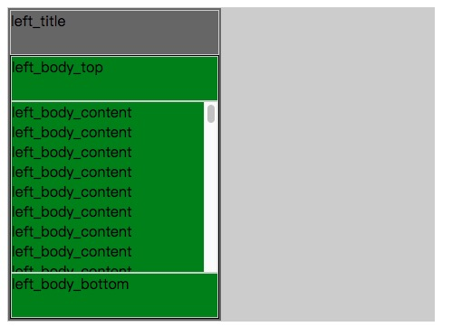

# css grid 溢出滚动   

上下固定高度,中间滚动是很多网页的典型布局.加上左右两侧的话就是 `圣杯布局`    

这次碰到的问题是多级 `grid` 嵌套之后需要进行溢出滚动。   

   


## 主要使用 `max-height` 来控制高度.   
  
[参考链接 —— stack overflow](https://stackoverflow.com/questions/43352501/css-grid-content-to-use-free-space-but-scroll-when-bigger)

```html
<!DOCTYPE html>
<html lang="en">

<head>
  <meta charset="UTF-8">
  <title>css grid</title>
  <style type="text/css">
    body,
    html {
      height: 60%;
      width: 70%;
    }

    div {
      border: 1px solid #ccc;
    }

    .container {
      width: 100%;
      height: 100%;
      background: rgba(0, 0, 0, .2);
      display: grid;
      grid-template-columns: 1fr 1fr;
    }

    .left {
      max-height: 100%;
      overflow: auto;
      border: 2px #666 solid;
      background: rgba(0, 0, 0, .5);
      display: grid;
      grid-template-rows: 50px 1fr;
    }

    .left_title {}

    .left_body {
      max-height: 100%;
      overflow: hidden;
      border: 1px solid #000;
      background: green;
      display: grid;
      grid-template-rows: 50px 1fr 50px;
    }

    .left_body_content {
      max-height: 100%;
      overflow-y: scroll;
    }
  </style>
</head>

<body>
  <div class="container">
    <div class="left">
      <div class="left_title">left_title</div>
      <div class="left_body">
        <div class="left_body_top">left_body_top</div>
        <div class="left_body_content">
          left_body_content
          <br>left_body_content
          <br>left_body_content
          <br>left_body_content
          <br>left_body_content
          <br>left_body_content
          <br>left_body_content
          <br>left_body_content
          <br>left_body_content
          <br>left_body_content
          <br>left_body_content
          <br>left_body_content
          <br>left_body_content
          <br>left_body_content
          <br>left_body_content
          <br>left_body_content
          <br>left_body_content
          <br>left_body_content
          <br>left_body_content
          <br>left_body_content
          <br>left_body_content
          <br>left_body_content
          <br>left_body_content
          <br>left_body_content
          <br>left_body_content
          <br>left_body_content
          <br>left_body_content
          <br>left_body_content
          <br>left_body_content
          <br>left_body_content
          <br>left_body_content
          <br>left_body_content
          <br>left_body_content
          <br>left_body_content
          <br>left_body_content
          <br>left_body_content
          <br>left_body_content
          <br>left_body_content
          <br>left_body_content
          <br>left_body_content
          <br>left_body_content
          <br>left_body_content
          <br>left_body_content
          <br>left_body_content
          <br>left_body_content
          <br>left_body_content
          <br>left_body_content
          <br>left_body_content
          <br>left_body_content
          <br>left_body_content
          <br>left_body_content
          <br>left_body_content
          <br>left_body_content
          <br>left_body_content
          <br>left_body_content
          <br>left_body_content
          <br>left_body_content
          <br>left_body_content
          <br>left_body_content
          <br>left_body_content
          <br>left_body_content_end
        </div>
        <div class="left_body_bottom">left_body_bottom</div>
      </div>
    </div>
    <div class="right"></div>
  </div>
</body>

</html>
```