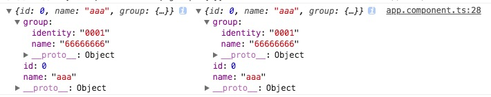

# _.filter()

**_.filter() 出来的结果不会进行._cloneDeep() 深复制**


```javascript
users = [
    { id: 0, name: 'aaa', group: { name: 'tokie', identity: '0001' } },
    { id: 1, name: 'vvv', group: { name: 'asdsa', identity: '0002' } },
    { id: 2, name: 'vv123v', group: { name: 'asdsa', identity: '0003' } },
    { id: 3, name: 'aaa', group: { name: 'asdsa', identity: '0004' } }
    { id: 4, name: 'aaa', group: { name: 'asdsa', identity: '0005' } }
];

let user = _.cloneDeep(users,{name:'aaa'});
user[0].group.name = '666';
console.log(users[0],user[0]);
```

结果:

